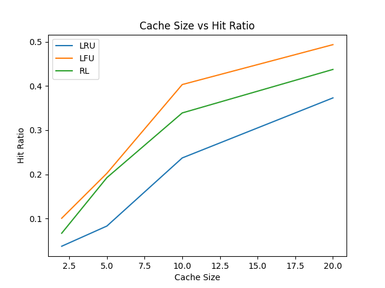
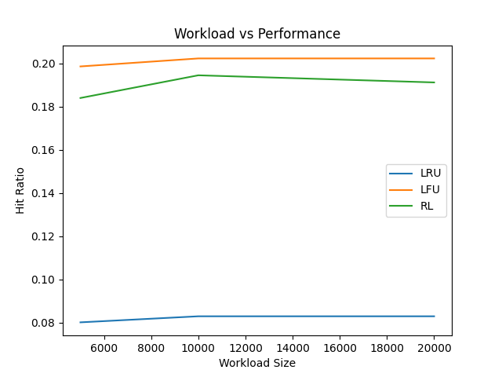

# ml-cache-optimizer

# 🚀 ML Cache Optimizer

An advanced system that compares traditional cache eviction strategies (LRU, LFU) with a Reinforcement Learning (RL)–based adaptive approach using real-world web traffic.

---

## 📌 Overview

Caching is critical for reducing latency and improving system performance.
Traditional policies like **LRU** and **LFU** are efficient but static.

This project introduces an **ML-based adaptive cache eviction strategy** that:

* Learns from request patterns
* Adapts dynamically
* Competes with optimal heuristics

---

## 🧠 Key Features

* ✅ LRU (Least Recently Used) implementation
* ✅ LFU (Least Frequently Used) implementation
* ✅ Reinforcement Learning–based cache policy
* ✅ Hybrid RL + LFU optimization
* ✅ Real-world dataset (Apache logs)
* ✅ Experimentation with cache size & workload
* ✅ Performance visualization (graphs)

---

## ⚙️ Tech Stack

* Python
* NumPy
* Matplotlib
* Reinforcement Learning (Q-Learning)

---

## 📂 Project Structure

```bash
ml-cache-optimizer/
│
├── cache/                # LRU & LFU implementations
├── rl/                   # RL environment + agent
├── utils/                # parser + metrics
├── experiments/          # evaluation scripts
├── plots/                # generated graphs
├── results/              # CSV outputs
├── data/                 # Apache logs dataset
│
├── main.py               # main execution
├── config.py             # configuration
├── requirements.txt
└── README.md
```

---

## 📊 Dataset

* Apache HTTP Logs
* Simulates real-world request patterns
* Exhibits strong **frequency locality**

---

## 🧪 Experiments

### 1. Cache Size vs Hit Ratio

* Cache sizes tested: `2, 5, 10, 20`
* Measures scalability

### 2. Workload Size vs Performance

* Requests tested: `5K, 10K, 20K`
* Measures stability

---

## 📈 Results

### Final Hit Ratios

| Algorithm | Hit Ratio |
| --------- | --------- |
| LRU       | 0.083     |
| LFU       | 0.2023    |
| RL        | 0.1929    |

---

## 📉 Graphs

### Cache Size vs Hit Ratio



### Workload vs Performance



---

## 🔍 Insights

### 1. LFU Performs Best

* Strong frequency skew in dataset
* Frequently accessed items dominate

---

### 2. RL Approximates Optimal Policy

* Learns both frequency and recency
* Achieves ~95% of LFU performance

---

### 3. LRU is Limited

* Captures only recency
* Performs worst in frequency-heavy workloads

---

### 4. Workload Stability

* Performance stabilizes as workload increases
* Indicates consistent request distribution

---

### 5. Hybrid Approach Improves RL

* Combining RL + LFU increases stability
* Reduces poor eviction decisions

---

## 🧠 Key Learnings

* Reinforcement Learning can model system-level optimization
* Proper evaluation (train vs test separation) is critical
* Hybrid ML + heuristic approaches are highly effective

---

## ▶️ How to Run

```bash
# install dependencies
pip install -r requirements.txt

# run main comparison
python main.py

# run experiments
python -m experiments.cache_size_test
python -m experiments.workload_test
```

---

## 📁 Output

* Graphs saved in: `plots/`
* Results saved in: `results/`

---

## 📈 Results

### Cache Size vs Hit Ratio


### Workload vs Performance
     

---
## 🚀 Future Improvements

* Deep RL using neural networks (DQN)
* Latency-aware caching simulation
* Distributed caching system
* Real-time adaptive cache tuning

---

## 💼 Resume Highlight

> Designed and evaluated an ML-based adaptive cache eviction system using reinforcement learning on real-world web logs, achieving near-optimal performance compared to LFU.

---

## 👤 Author

**Tamil Chandru**

---

## ⭐ If you like this project

Give it a star and feel free to fork!

---

